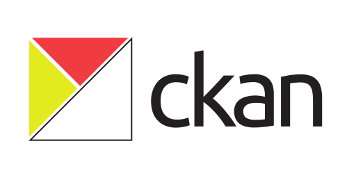
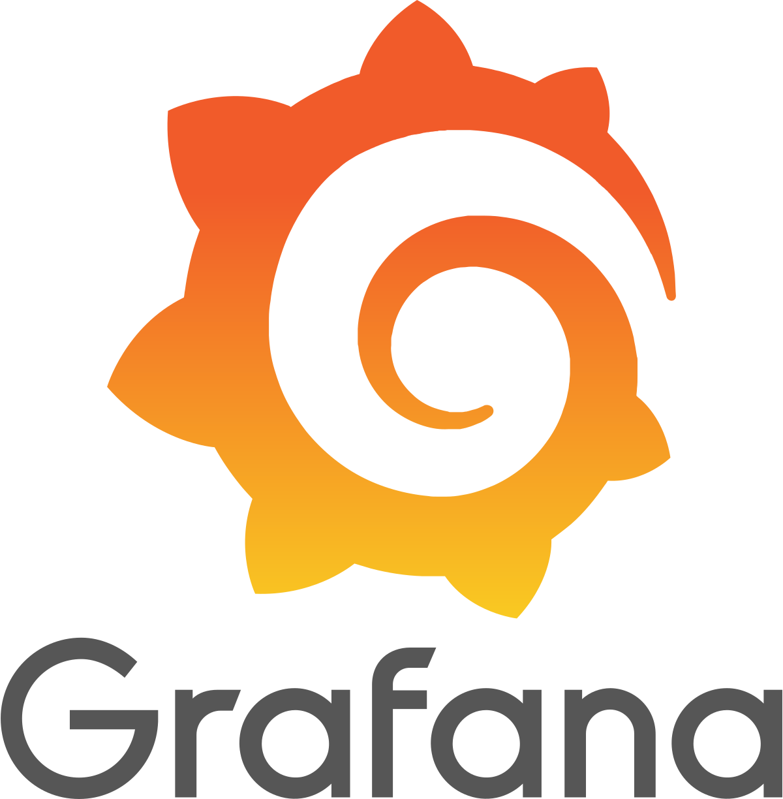

Eine unserer Vereinsziele ist die Arbeit mit offenen Daten. Wir haben uns zum Ziel gesetzt, die Bedeutung offener Daten zu verdeutlichen und deren Verwendung zu fördern. Dabei arbeiten wir an verschiedenen Open Source Projekten und an der Verbreitung von Open Data.

Neben dem Open Data Day organisieren wir über das Jahr verteilt Hackadays und Workshops rund um Open Data.

Außerdem sammeln wir selbst offene Daten in unserem selbst gehosteten CKAN-Portal. Zum Teil werden diese Daten dann auch im Grafana visualisiert. Im Grafana sind Daten aktuell und in Echtzeit verfügbar. Automatisierte Exporte nach CKAN sind in Planung.

  

    
  

  

     
  

